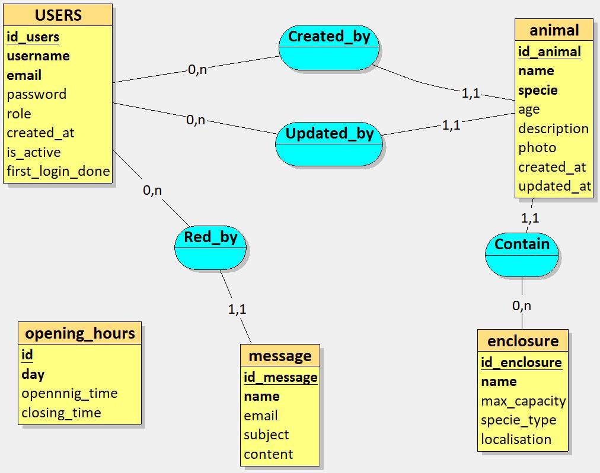
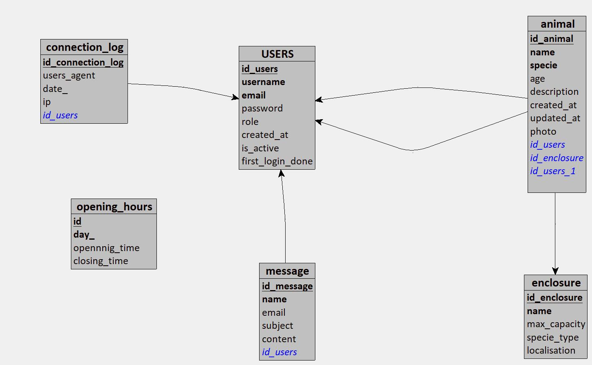

# Conception de la Base de Données avec Merise
## Sommaire
1. [Règles de Gestion](#règles-de-gestion)
2. [Dictionnaire de Données](#dictionnaire-de-données)
3. [MCD](#mcd)
4. [MLD](#mld)
5. [MPD](#mpd)
6. [Table SQL](#table-sql)

## Règles de Gestion
### 🔐 Utilisateurs et sécurité

1. Un utilisateur est identifié de manière unique par un identifiant (id).

2. Chaque utilisateur possède un nom d’utilisateur (username) unique et non vide.

3. Chaque utilisateur possède une adresse e-mail unique, valide, et obligatoire.

4. Le mot de passe est obligatoire, non vide et stocké de manière sécurisée (haché avec bcrypt).

5. La date de création du compte est enregistrée automatiquement.

6. À la création, un mot de passe temporaire est généré par l’administrateur.

7. Lors de la première connexion, l’utilisateur doit obligatoirement changer ce mot de passe temporaire.
8. L’authentification nécessite un e-mail et un mot de passe valides.

9. Seul un administrateur peut créer ou désactiver un compte utilisateur.

10. Le rôle d’un utilisateur (VISITEUR, EMPLOYE, ADMIN) est défini dans la base et utilisé pour filtrer l’accès aux ressources.

11. Les opérations de lecture, modification ou suppression sont sécurisées par JWT (JSON Web Tokens).

12. Les mots de passe ne sont jamais renvoyés dans les réponses de l’API.

13. Les données sont persistées dans une base PostgreSQL.

### ⚙️ Droits et rôles

14. Les visiteurs ne peuvent pas se connecter ; ils accèdent uniquement à des routes publiques (liste des animaux, nous contacter).

15. Seuls les employés et administrateurs peuvent se connecter via /login.

16. L’accès aux routes sensibles (ex. : /admin, /gestion-animaux, /utilisateurs) est réservé selon le rôle :

- ADMIN : accès total.

- EMPLOYE : accès aux animaux, messages, modification de son mot de passe.

17. L’interface d’administration est accessible uniquement aux administrateurs (/admin).

### 🐾 Gestion des animaux

18. Un animal est identifié de manière unique par un id.

19. Chaque animal possède un nom, une espèce, un âge, une description, une photo (optionnelle), et un statut (adopté, disponible, etc.).

20. Les animaux peuvent être consultés publiquement (même par des visiteurs).

21. Seuls les employés ou administrateurs peuvent créer, modifier ou supprimer les fiches des animaux.

22. Chaque fiche d’animal enregistre la date de création et la dernière mise à jour.

23. Chaque fiche est liée à l’employé qui l’a créée ou modifiée (traçabilité).

### 📩 Formulaire de contact

24. Le formulaire "Nous contacter" est accessible publiquement (par les visiteurs non connectés).

25. Un message contient : un nom, un e-mail valide, un sujet et un contenu.

26. Les messages sont stockés dans la base avec leur date d’envoi.

27. Seuls les employés et administrateurs peuvent lire et répondre aux messages.

### 🔒 Sécurité et données sensibles
28. Le mot de passe ne doit jamais être stocké en clair. Il est haché à l’aide de bcrypt, et seul le hachage est stocké dans la base de données.


29. Les utilisateurs doivent être automatiquement déconnectés après une période d’inactivité définie (ex. : 30 minutes).


30. Les données sensibles (comme l'email et le mot de passe) ne doivent jamais être renvoyées dans les réponses d’API, même dans les réponses d'erreur.


###  🏢 Gestion de l'administration et des rôles
31. Les administrateurs peuvent modifier les rôles des utilisateurs (par exemple, attribuer ou révoquer le rôle d'administrateur).


32. Un administrateur peut désactiver temporairement un compte utilisateur sans le supprimer de la base de données.


###  🐾 Gestion des animaux
33. Chaque animal doit être lié à un enclos spécifique. Un enclos peut contenir plusieurs animaux.


34. Le statut d’un animal (disponible, en soin, etc.) peut être mis à jour uniquement par un employé ou un administrateur.


### 🏠 Enclos
35. Chaque enclos doit avoir une capacité maximale d'animaux. Cette capacité doit être vérifiée lors de l'ajout d’un nouvel animal dans un enclos.


### 📩 Formulaire de contact
36. Les messages envoyés via le formulaire "Nous contacter" doivent être traités par les employés ou administrateurs 

## Dictionnaire de Données

1. Utilisateur

| Nom du champ|	Type |   Contraintes |   Description |
|--------------|----------|--------------------|-------------|
| id	| UUID / SERIAL	PK,| unique, non nul	|Identifiant unique de l’utilisateur |
|username|	VARCHAR(50)	|unique, non nul|	Nom d’utilisateur
|email	|VARCHAR(100)	|unique, non nul, format email|	Adresse email de l’utilisateur|
|password|	TEXT	|non nul, haché (bcrypt)	|Mot de passe haché|
|role	|ENUM	|valeurs :  'EMPLOYE', 'ADMIN'	|Rôle de l’utilisateur|
|created_at	|TIMESTAMP	|auto-généré|Date de création du compte|
|is_active|	BOOLEAN	|défaut true|	Statut actif ou désactivé du compte|
|first_login_done|	BOOLEAN	|défaut false|	Indique si le mot de passe a été changé

2. Animal

| Nom du champ|	Type |   Contraintes |   Description |
|--------------|----------|--------------------|-------------|
|id	|UUID / SERIAL	PK, |unique, non nul	|Identifiant unique de l’animal
nom	|VARCHAR(100)	|non nul|	Nom de l’animal
espece	|VARCHAR(100)|	non nul|	Espèce de l’animal
age	|INTEGER|	≥ 0	|Âge de l’animal en années
description	|TEXT	|optionnel|	Description de l’animal
photo_url	|TEXT	|optionnel	|URL de la photo
enclos_id|	FOREIGN KEY	|vers Enclos(id),| non nul	|Référence à l’enclos de l’animal
created_by|	FOREIGN KEY|	vers Utilisateur(id)	|Créateur de la fiche
updated_by|	FOREIGN KEY	|vers Utilisateur(id)|	Dernier à avoir modifié
created_at|	TIMESTAMP|	auto-généré	|Date de création
updated_at|	TIMESTAMP|	auto-maj	|Date de dernière modification

3. Enclos

| Nom du champ|	Type |   Contraintes |   Description |
|--------------|----------|--------------------|-------------|
id	|UUID / SERIAL|	PK, unique, non nul	|Identifiant de l’enclos
nom	|VARCHAR(100)|	non nul, unique	|Nom de l’enclos
capacite_max	|INTEGER	|> 0|	Capacité maximale d’animaux
type_espece	|VARCHAR(100)	|optionnel	|Type d’espèce prévue (si spécifique)
localisation	|VARCHAR(255)|	optionnel|	Position ou référence dans le zoo

4. Message (Nous Contacter)

| Nom du champ|	Type |   Contraintes |   Description |
|--------------|----------|--------------------|-------------|
id	|UUID / SERIAL	|PK, unique, non nul	|Identifiant du message
nom	|VARCHAR(100)	|non nul	|Nom du visiteur
email|	VARCHAR(100)	|non nul, format email	|Email de contact
sujet	|VARCHAR(255)	|non nul	|Sujet du message
contenu	|TEXT	|non nul	|Corps du message
date_envoi	|TIMESTAMP|	auto-généré	|Date d’envoi
lu_par|	FOREIGN KEY|	vers Utilisateur(id), null par défaut	|Employé qui a lu ou répondu

5. Journal de Connexions

| Nom du champ|	Type |   Contraintes |   Description |
|--------------|----------|--------------------|-------------|
id	|UUID / SERIAL|	PK, unique, non nul	|Identifiant
user_id	|FOREIGN KEY	|vers Utilisateur(id)	|Utilisateur connecté
date_connexion|	TIMESTAMP|	auto-généré|	Date/heure de connexion
adresse_ip|	VARCHAR(50)|	optionnel	|Adresse IP
user_agent	|TEXT	|optionnel|	Informations sur le navigateur


6. HORAIRES_ZOO 

| Nom du champ|	Type |   Contraintes |   Description |
|--------------|----------|--------------------|-------------|
id_horaire|	SERIAL (int)|	PK	Identifiant unique|Identifiant
jour	|VARCHAR(20)	|NOT NULL|	Jour de la semaine
heure_ouverture	|TIME	|NOT NULL	|Heure d'ouverture du zoo
heure_fermeture	|TIME	|NOT NULL|	Heure de fermeture du zoo

## MCD 
(Modèle Conceptuel de Données)



## MLD 
(Modèle Logique de Données)

## MPD 
(Modèle Physique de Données)


```sql
CREATE TABLE USERS(
   id_users VARCHAR(50),
   username VARCHAR(50) NOT NULL,
   email VARCHAR(50) NOT NULL,
   password VARCHAR(100) NOT NULL,
   role LOGICAL NOT NULL,
   created_at DATETIME NOT NULL,
   is_active LOGICAL NOT NULL,
   first_login_done LOGICAL NOT NULL,
   PRIMARY KEY(id_users),
   UNIQUE(username),
   UNIQUE(email)
);


CREATE TABLE opening_hours (
   id UUID DEFAULT gen_random_uuid(),
   day_ VARCHAR(10) NOT NULL,
   opening_time TIME NOT NULL,
   closing_time TIME NOT NULL,
   PRIMARY KEY(id),
   UNIQUE(day_),
   CHECK(closing_time > opening_time)
);

CREATE TABLE message(
   id_message VARCHAR(50),
   name VARCHAR(50) NOT NULL,
   email VARCHAR(50) NOT NULL,
   subject VARCHAR(50) NOT NULL,
   content TEXT NOT NULL,
   id_users VARCHAR(50) NOT NULL,
   PRIMARY KEY(id_message),
   UNIQUE(name),
   FOREIGN KEY(id_users) REFERENCES USERS(id_users)
);

CREATE TABLE connection_log(
   id_connection_log VARCHAR(50),
   users_agent TEXT,
   date_ DATETIME NOT NULL,
   ip VARCHAR(50) NOT NULL,
   id_users VARCHAR(50) NOT NULL,
   PRIMARY KEY(id_connection_log),
   FOREIGN KEY(id_users) REFERENCES USERS(id_users)
);
CREATE TABLE enclosure (
    id_enclosure UUID PRIMARY KEY DEFAULT gen_random_uuid(),
    name VARCHAR(50) NOT NULL UNIQUE,
    max_capacity INT NOT NULL,
    specie_type VARCHAR(50) NOT NULL,
    localisation INT NOT NULL
);

CREATE TABLE animal (
      id_animal UUID PRIMARY KEY DEFAULT gen_random_uuid(),
      name VARCHAR(50) NOT NULL,
      specie VARCHAR(50) NOT NULL,
      age INT NOT NULL,
      description TEXT,
      created_at TIMESTAMP NOT NULL,
      updated_at TIMESTAMP NOT NULL,
      photo TEXT,
      created_by VARCHAR(50) NOT NULL,
      updated_by VARCHAR(50) NOT NULL,
      id_enclosure UUID NOT NULL,

      FOREIGN KEY (created_by) REFERENCES users(id_users),
      FOREIGN KEY (updated_by) REFERENCES users(id_users),
      FOREIGN KEY (id_enclosure) REFERENCES enclosure(id_enclosure)
);
